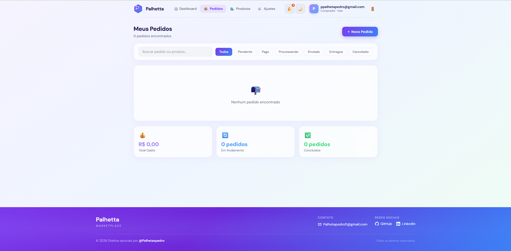
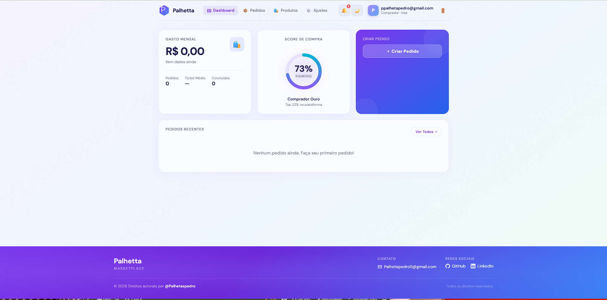
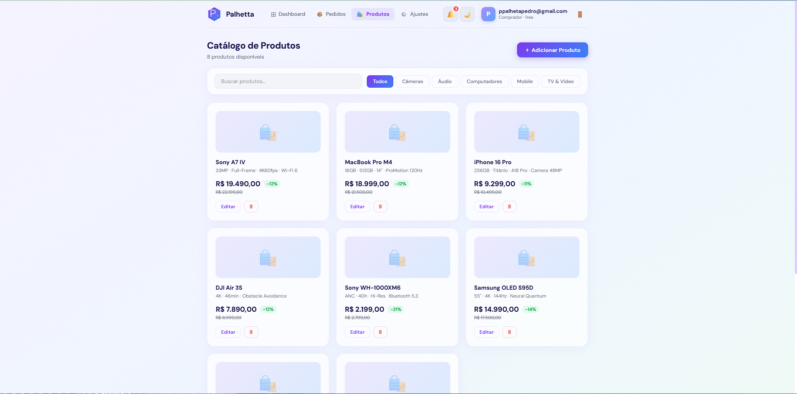

# 🛍️ DashboardPalhetta

> **Marketplace dashboard** para gerenciamento completo de fluxo comercial — com autenticação por roles, CRUD de produtos e pedidos, e painel administrativo.


** Conta disponivel:** Email:palhetateste@gmail.com | Senha:teste123456

** Live Demo:** [dashboardpalhetta.vercel.app](https://dashboardpalhetta.vercel.app)  
** Repositório:** [github.com/Palhetaspedro/DashboardPalhetta](https://github.com/Palhetaspedro/DashboardPalhetta)

---

##  Screenshots

| Dashboard (Comprador) | Pedidos | Produtos |
|---|---|---|
|  |  |  |

##  Sobre o Projeto

O **DashboardPalhetta** é um sistema de marketplace B2C com painel de controle completo. A plataforma conecta compradores e vendedores, oferecendo uma experiência personalizada por tipo de usuário — com diferentes permissões, visões e funcionalidades para cada role.

O sistema foi desenvolvido com foco em:
- Separação clara de responsabilidades por role
- UI responsiva e moderna com tema claro/escuro
- Autenticação segura via Supabase Auth + JWT
- Persistência de dados com PostgreSQL via Supabase

---

##  Funcionalidades

###  Comprador
- Visualizar catálogo de produtos com filtros por categoria
- Criar e gerenciar pedidos
- Acompanhar status dos pedidos em tempo real
- Visualizar histórico de compras e gastos
- Score de comprador com ranking na plataforma

###  Vendedor
- Visualizar pedidos disponíveis para aceite
- Gerenciar status de entregas
- Painel com métricas de desempenho (pedidos aceitos, taxa de conclusão, avaliação)
- Contador regressivo para próxima janela de pedidos

###  Administrador
- Herda todas as funcionalidades de Comprador e Vendedor
- CRUD completo de produtos (criar, editar, excluir, visualizar)
- Gerenciamento de disputas entre usuários
- Visão global de todos os pedidos e usuários
- Atualização de perfis e roles

---

##  Módulos do Sistema

| Módulo        | Descrição                                              |
|---------------|--------------------------------------------------------|
| **Dashboard** | Visão geral com métricas, pedidos recentes e CTA       |
| **Pedidos**   | Listagem, filtros por status e criação de novos pedidos|
| **Produtos**  | Catálogo com CRUD completo e upload de imagem          |
| **Disputas**  | Abertura e acompanhamento de disputas                  |
| **Ajustes**   | Edição de perfil, preferências e configurações         |

---

##  Sistema de Roles

```
Admin
 ├── Gerenciar todos os usuários e perfis
 ├── CRUD completo de produtos
 ├── Ver e atualizar todos os pedidos
 └── Gerenciar e resolver disputas

Vendedor
 ├── Ver pedidos disponíveis para aceite
 ├── Atualizar status dos seus pedidos
 └── Métricas de desempenho no painel

Comprador
 ├── Criar pedidos
 ├── Acompanhar status dos próprios pedidos
 └── Abrir disputas
```

---

##  Stack Tecnológica

| Tecnologia          | Uso                                         |
|---------------------|---------------------------------------------|
| **React 18**        | Interface de usuário                        |
| **TypeScript**      | Tipagem estática                            |
| **Vite**            | Bundler e dev server                        |
| **Supabase**        | Backend as a Service (Auth + PostgreSQL)    |
| **PostgreSQL**      | Banco de dados relacional                   |
| **Row Level Security (RLS)** | Controle de acesso por role no DB |
| **Vercel**          | Deploy e hospedagem                         |

---

##  Modelagem do Banco de Dados

```
profiles          → Dados do usuário (name, role, plan, phone, bio)
sales             → Pedidos (product, amount, status, buyer_id, seller_id)
products          → Catálogo (name, price, specs, category, image, seller_id)
disputes          → Disputas (reason, status, created_by)
```

### Políticas RLS implementadas
- Comprador só acessa os próprios pedidos
- Vendedor só acessa pedidos onde é o seller
- Admin acessa todos os registros
- Trigger automático cria perfil ao registrar usuário

---

##  Como Rodar Localmente

### Pré-requisitos
- Node.js 18+
- Conta no [Supabase](https://supabase.com)

### Passo a passo

```bash
# 1. Clone o repositório
git clone https://github.com/Palhetaspedro/DashboardPalhetta.git
cd DashboardPalhetta

# 2. Instale as dependências
npm install

# 3. Configure as variáveis de ambiente
cp .env.example .env.local
# Preencha VITE_SUPABASE_URL e VITE_SUPABASE_ANON_KEY

# 4. Execute o schema no Supabase
# Acesse seu projeto no Supabase → SQL Editor
# Cole e execute o conteúdo de supabase-schema.sql

# 5. Inicie o servidor de desenvolvimento
npm run dev
```

### Variáveis de ambiente

```env
VITE_SUPABASE_URL=https://seu-projeto.supabase.co
VITE_SUPABASE_ANON_KEY=sua-anon-key
```

---

##  Estrutura do Projeto

```
src/
├── components/        # Componentes reutilizáveis (UI, Navbar, Footer...)
├── context/           # AuthContext — autenticação e estado global do usuário
├── data/              # Camada de dados (sales.ts, disputes.ts, mockData.ts)
├── hooks/             # Custom hooks (useApp, useInView...)
├── lib/               # Cliente Supabase
└── pages/             # Páginas da aplicação
    ├── DashboardPage
    ├── OrdersPage
    ├── ProductsPage
    ├── DisputesPage
    ├── SellerAdminPage
    └── SettingsPage
```

##  Roadmap

- [x] Autenticação com Supabase Auth
- [x] Sistema de roles (Admin / Vendedor / Comprador)
- [x] Dashboard com métricas por role
- [x] CRUD de produtos com upload de imagem
- [x] Criação e acompanhamento de pedidos
- [x] Sistema de disputas
- [x] Tema claro/escuro
- [ ] Integração com gateway de pagamento
- [ ] Notificações em tempo real (Supabase Realtime)
- [ ] Chat entre comprador e vendedor
- [ ] Exportação de relatórios (PDF/CSV)
- [ ] App mobile (React Native)

---

##  Autor

**Pedro Palheta**  
[](https://www.linkedin.com/in/pedro-palheta-b81017321/)
[](https://github.com/Palhetaspedro)

---


<p align="center">
  Feito com ☕ e TypeScript por <strong>@Palhetaspedro</strong>
</p>
